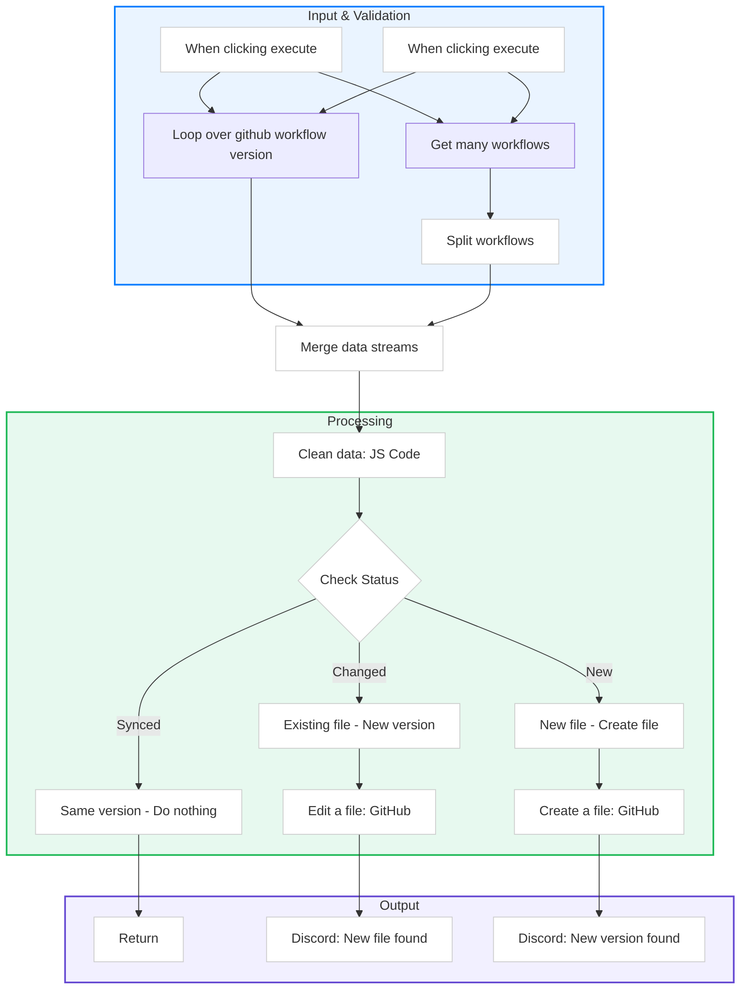

```mermaid
graph TD
    %% SUBGRAPH: INPUT & VALIDATION (n8n Blue)
    subgraph Input [Input & Validation]
       A1[When clicking execute] --> B[Get many workflows]
       A2[Schedule Trigger] --> B[Get many workflows]
       B --> B2[Split workflows]
       A1[When clicking execute] --> C[Loop over github workflow version]
       A2[When clicking execute] --> C[Loop over github workflow version]
    end

    C --> D[Merge data streams]
    B2 --> D[Merge data streams]

    D --> E

    %% SUBGRAPH: PROCESSING (n8n Green)
    subgraph Processing [Processing]
        E[Clean data: JS Code] --> F{Check Status}
        
        F -- Synced --> G1[Same version - Do nothing]
        F -- Changed --> G2[Existing file - New version]
        F -- New --> G3[New file - Create file]
        
        G2 --> H1[Edit a file: GitHub]
        G3 --> H2[Create a file: GitHub]
    end

    G1 --> I1
    H1 --> I2
    H2 --> I3

    %% SUBGRAPH: OUTPUT (n8n Purple)
    subgraph Output [Output]
        I1[Return]
        I2[Discord: New file found]
        I3[Discord: New version found]
    end

    %% STYLE DEFINITIONS
    classDef whiteNode fill:#fff,stroke:#ccc,stroke-width:1px,color:#333;
    
    %% n8n Theme Colors
    classDef n8nInput fill:#eaf4ff,stroke:#007bff,stroke-width:2px;
    classDef n8nProcess fill:#e7f9ef,stroke:#1db855,stroke-width:2px;
    classDef n8nOutput fill:#f2f0ff,stroke:#6346d1,stroke-width:2px;

    %% APPLY STYLES
    class A1,A2,B1,B2,C1,C2,D,E,F,G1,G2,G3,H1,H2,I1,I2,I3 whiteNode;
    class Input n8nInput;
    class Processing n8nProcess;
    class Output n8nOutput;
```