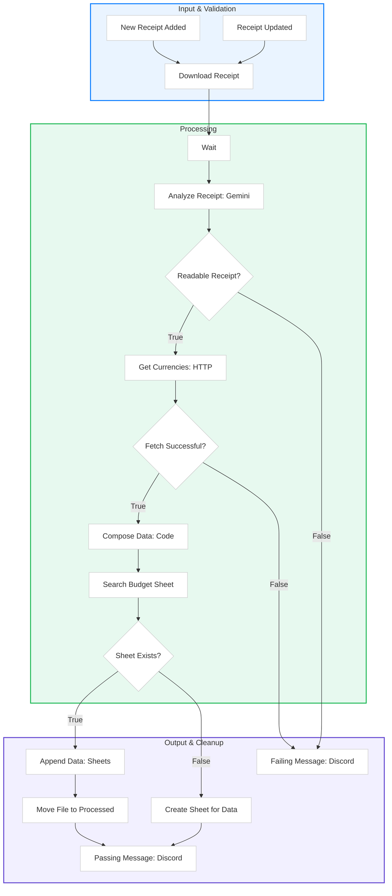

```mermaid
graph TD
    %% SUBGRAPH: INPUT & VALIDATION (n8n Blue)
    subgraph Input [Input & Validation]
        A1[New Receipt Added] --> B[Download Receipt]
        A2[Receipt Updated] --> B
    end

    B --> C

    %% SUBGRAPH: PROCESSING (n8n Green)
    subgraph Processing [Processing]
        C[Wait] --> D[Analyze Receipt: Gemini]
        D --> E{Readable Receipt?}
        
        E -- True --> F[Get Currencies: HTTP]
        F --> G{Fetch Successful?}
        
        G -- True --> H[Compose Data: Code]
        H --> I[Search Budget Sheet]
        I --> J{Sheet Exists?}
    end

    %% BRANCHING TO OUTPUT
    J -- True --> K1[Append Data: Sheets]
    J -- False --> K2[Create Sheet for Data]
    
    E -- False --> L1[Failing Message: Discord]
    G -- False --> L1

    %% SUBGRAPH: OUTPUT (n8n Purple)
    subgraph Output [Output & Cleanup]
        K1 --> M[Move File to Processed]
        M --> L2[Passing Message: Discord]
        K2 --> L2
        L1
    end

    %% STYLE DEFINITIONS
    classDef whiteNode fill:#fff,stroke:#ccc,stroke-width:1px,color:#333;
    
    %% n8n Theme Colors
    classDef n8nInput fill:#eaf4ff,stroke:#007bff,stroke-width:2px;
    classDef n8nProcess fill:#e7f9ef,stroke:#1db855,stroke-width:2px;
    classDef n8nOutput fill:#f2f0ff,stroke:#6346d1,stroke-width:2px;

    %% APPLY STYLES
    class A1,A2,B,C,D,E,F,G,H,I,J,K1,K2,L1,L2,M whiteNode;
    class Input n8nInput;
    class Processing n8nProcess;
    class Output n8nOutput;
```