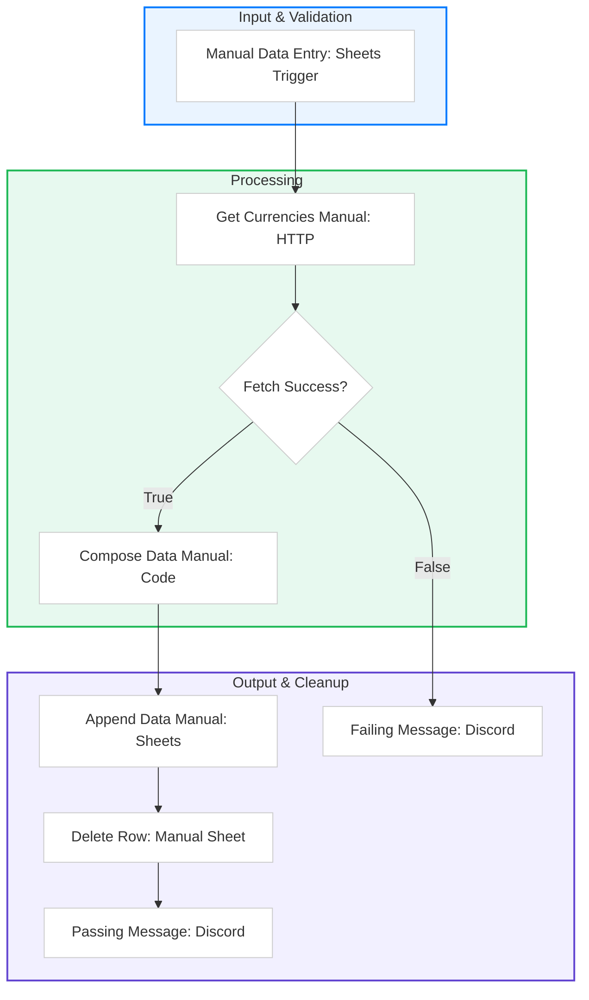

```mermaid
graph TD
    %% SUBGRAPH: INPUT & VALIDATION (n8n Blue)
    subgraph Input [Input & Validation]
        A[Manual Data Entry: Sheets Trigger]
    end

    A --> B

    %% SUBGRAPH: PROCESSING (n8n Green)
    subgraph Processing [Processing]
        B[Get Currencies Manual: HTTP] --> C{Fetch Success?}
        
        C -- True --> D[Compose Data Manual: Code]
    end

    D --> E
    C -- False --> F1

    %% SUBGRAPH: OUTPUT (n8n Purple)
    subgraph Output [Output & Cleanup]
        E[Append Data Manual: Sheets] --> G[Delete Row: Manual Sheet]
        G --> F2[Passing Message: Discord]
        F1[Failing Message: Discord]
    end

    %% STYLE DEFINITIONS
    classDef whiteNode fill:#fff,stroke:#ccc,stroke-width:1px,color:#333;
    
    %% n8n Theme Colors
    classDef n8nInput fill:#eaf4ff,stroke:#007bff,stroke-width:2px;
    classDef n8nProcess fill:#e7f9ef,stroke:#1db855,stroke-width:2px;
    classDef n8nOutput fill:#f2f0ff,stroke:#6346d1,stroke-width:2px;

    %% APPLY STYLES
    class A,B,C,D,E,F1,F2,G whiteNode;
    class Input n8nInput;
    class Processing n8nProcess;
    class Output n8nOutput;
```