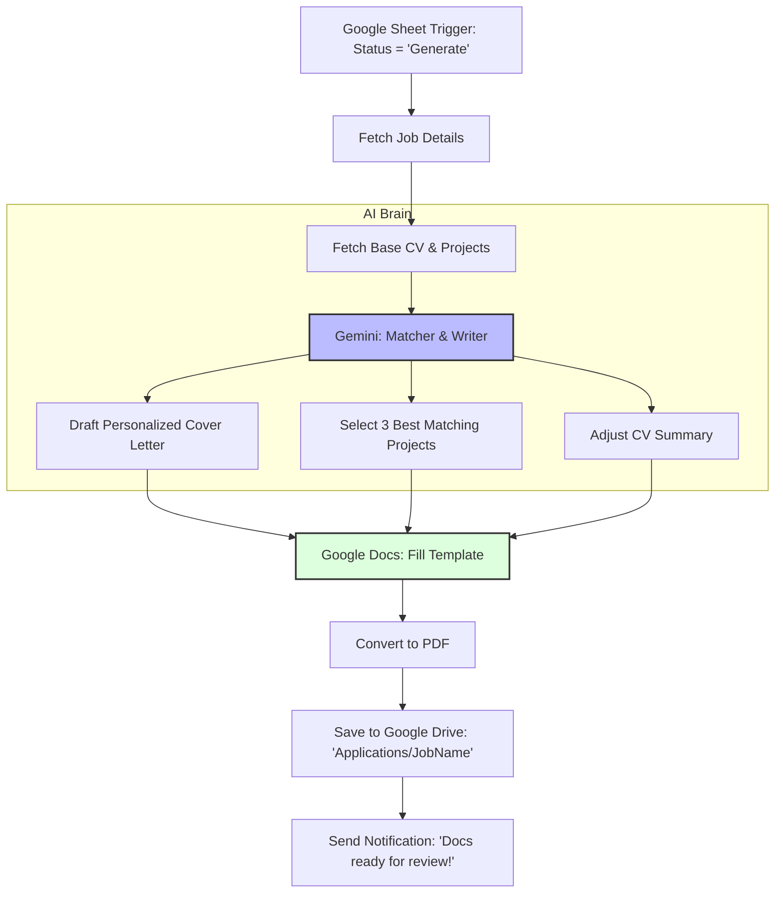

```mermaid
graph TD
    A[Google Sheet Trigger: Status = 'Generate'] --> B[Fetch Job Details]
    B --> C[Fetch Base CV & Projects]
    
    subgraph "AI Brain"
    C --> D[Gemini: Matcher & Writer]
    D --> D1[Draft Personalized Cover Letter]
    D --> D2[Select 3 Best Matching Projects]
    D --> D3[Adjust CV Summary]
    end
    
    D1 & D2 & D3 --> E[Google Docs: Fill Template]
    E --> F[Convert to PDF]
    F --> G[Save to Google Drive: 'Applications/JobName']
    G --> H[Send Notification: 'Docs ready for review!']

    style D fill:#bbf,stroke:#333,stroke-width:2px
    style E fill:#dfd,stroke:#333,stroke-width:2px
```