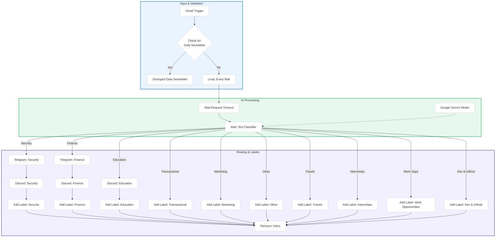

```mermaid
graph TD
    %% SUBGRAPH: INPUT & VALIDATION (n8n Blue)
    subgraph Input [Input & Validation]
        A[Gmail Trigger] --> B{Check for <br> Daily Newsletter}
        B -- Yes --> C[Disregard Daily Newsletter]
        B -- No --> D[Loop: Every Mail]
    end

    %% SUBGRAPH: PROCESSING (n8n Green)
    subgraph Processing [AI Processing]
        D --> E[Wait Request Timeout]
        E --> F[Mail: Text Classifier]
        G[Google Gemini Model] -.-> F
    end

    %% SUBGRAPH: OUTPUT (n8n Purple)
    subgraph Output [Routing & Labels]
        %% High Priority Paths (With Alerts)
        F -- Security --> T1[Telegram: Security] --> D1[Discord: Security] --> L1[Add Label: Security]
        F -- Finance --> T2[Telegram: Finance] --> D2[Discord: Finance] --> L2[Add Label: Finance]
        F -- Education --> D3[Discord: Education] --> L3[Add Label: Education]

        %% Standard Paths (Label Only)
        F -- Transactional --> L4[Add Label: Transactional]
        F -- Marketing --> L5[Add Label: Marketing]
        F -- Other --> L6[Add Label: Other]
        F -- Travels --> L7[Add Label: Travels]
        F -- Internships --> L8[Add Label: Internships]
        F -- Work Opps --> L9[Add Label: Work Opportunities]
        F -- Dev & Github --> L10[Add Label: Dev & Github]

        %% Global Cleanup
        L1 & L2 & L3 & L4 & L5 & L6 & L7 & L8 & L9 & L10 --> M[Remove: Inbox]
    end

    %% STYLE DEFINITIONS
    classDef whiteNode fill:#fff,stroke:#ccc,stroke-width:1px,color:#333;
    classDef n8nInput fill:#eaf4ff,stroke:#007bff,stroke-width:2px;
    classDef n8nProcess fill:#e7f9ef,stroke:#1db855,stroke-width:2px;
    classDef n8nOutput fill:#f2f0ff,stroke:#6346d1,stroke-width:2px;

    %% APPLY STYLES
    class A,B,C,D,E,F,G,T1,T2,D1,D2,D3,L1,L2,L3,L4,L5,L6,L7,L8,L9,L10,M whiteNode;
    class Input n8nInput;
    class Processing n8nProcess;
    class Output n8nOutput;
```