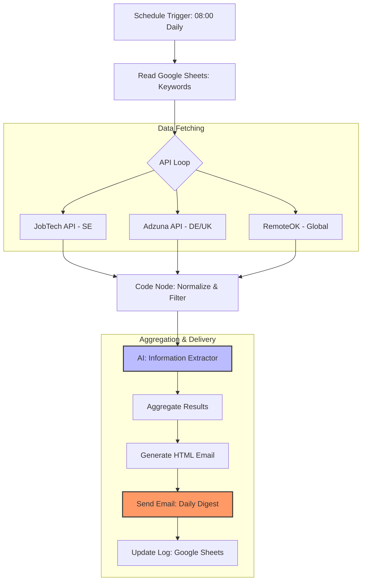

```mermaid
graph TD
    A[Schedule Trigger: 08:00 Daily] --> B[Read Google Sheets: Keywords]
    B --> C{API Loop}
    
    subgraph "Data Fetching"
    C --> D1[JobTech API - SE]
    C --> D2[Adzuna API - DE/UK]
    C --> D3[RemoteOK - Global]
    end
    
    D1 & D2 & D3 --> E[Code Node: Normalize & Filter]
    E --> F[AI: Information Extractor]
    
    subgraph "Aggregation & Delivery"
    F --> G[Aggregate Results]
    G --> H[Generate HTML Email]
    H --> I[Send Email: Daily Digest]
    I --> J[Update Log: Google Sheets]
    end

    style I fill:#f96,stroke:#333,stroke-width:2px
    style F fill:#bbf,stroke:#333,stroke-width:2px

```