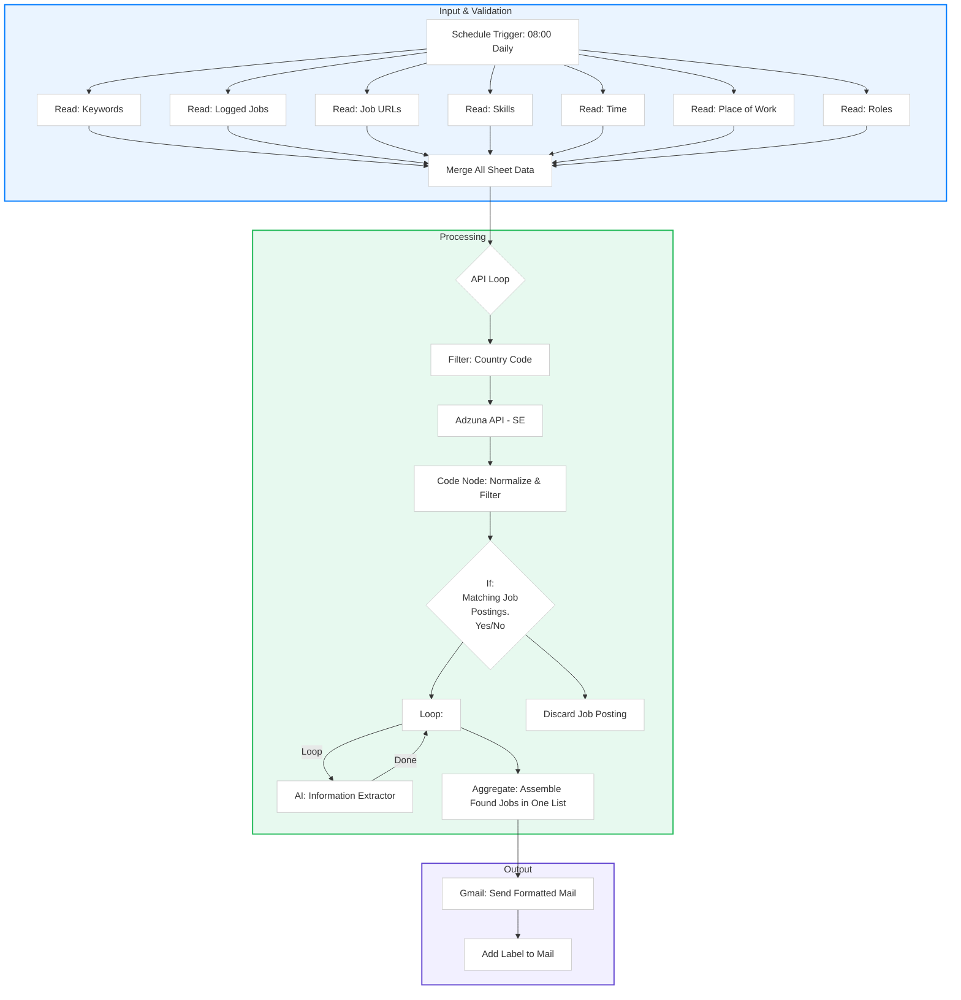

```mermaid
graph TD
    %% SUBGRAPH: INPUT & VALIDATION 
    subgraph Input [Input & Validation]
        A[Schedule Trigger: 08:00 Daily] --> GS1[Read: Keywords]
        A --> GS2[Read: Logged Jobs]
        A --> GS3[Read: Job URLs]
        A --> GS4[Read: Skills]
        A --> GS5[Read: Time]
        A --> GS6[Read: Place of Work]
        A --> GS7[Read: Roles]

        GS1 & GS2 & GS3 & GS4 & GS5 & GS6 & GS7 --> Merge[Merge All Sheet Data]
    end

    Merge --> C

    %% SUBGRAPH: PROCESSING 
    subgraph Processing [Processing]
        C{API Loop} --> D[Filter: Country Code]
        D --> E[Adzuna API - SE]
        
        E --> F[Code Node: Normalize & Filter]
        F --> G{If: <br> Matching Job <br> Postings. <br> Yes/No}
        G --> H[Loop:]
        H -- Loop --> I[AI: Information Extractor]
        I -- Done --> H
        G --> J[Discard Job Posting]
        H --> K[Aggregate: Assemble Found Jobs in One List]
    end

    K --> L

    %% SUBGRAPH: OUTPUT 
    subgraph Output [Output]
        L[Gmail: Send Formatted Mail] --> M[Add Label to Mail]
    end

    %% STYLE DEFINITIONS
    classDef whiteNode fill:#fff,stroke:#ccc,stroke-width:1px,color:#333;
    
    %% n8n Theme Colors
    classDef n8nInput fill:#eaf4ff,stroke:#007bff,stroke-width:2px;
    classDef n8nProcess fill:#e7f9ef,stroke:#1db855,stroke-width:2px;
    classDef n8nOutput fill:#f2f0ff,stroke:#6346d1,stroke-width:2px;

    %% APPLY STYLES
    class A,GS1,GS2,GS3,GS4,GS5,GS6,GS7,Merge,C,D,E,K,L,M,F,G,H,I,J whiteNode;
    class Input n8nInput;
    class Processing n8nProcess;
    class Output n8nOutput;

```