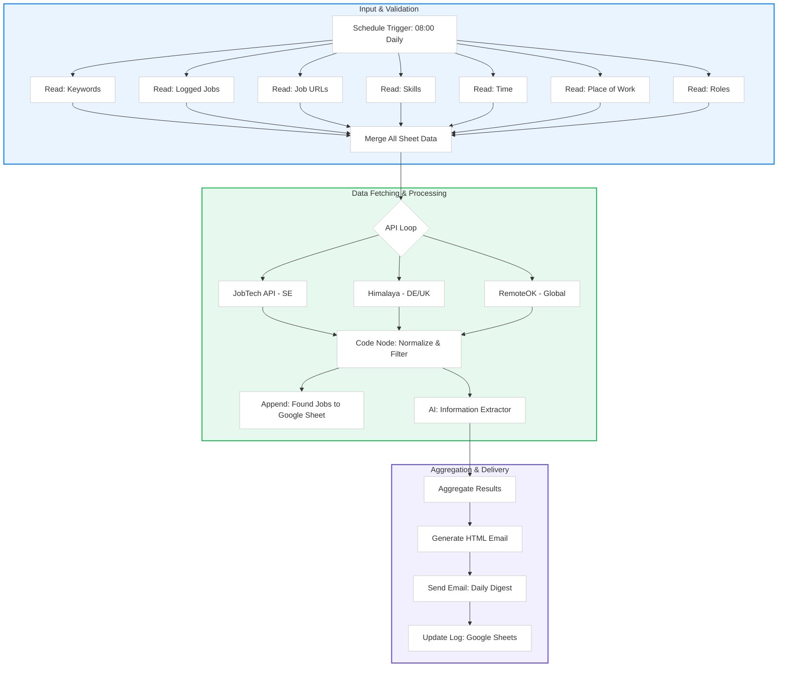

```mermaid
graph TD
    %% SUBGRAPH: INPUT (n8n Blue)
    subgraph Input [Input & Validation]
        A[Schedule Trigger: 08:00 Daily] --> GS1[Read: Keywords]
        A --> GS2[Read: Logged Jobs]
        A --> GS3[Read: Job URLs]
        A --> GS4[Read: Skills]
        A --> GS5[Read: Time]
        A --> GS6[Read: Place of Work]
        A --> GS7[Read: Roles]

        GS1 & GS2 & GS3 & GS4 & GS5 & GS6 & GS7 --> Merge[Merge All Sheet Data]
    end

    Merge --> C

    %% SUBGRAPH: PROCESSING (n8n Green)
    subgraph Fetch [Data Fetching & Processing]
        C{API Loop} --> D1[JobTech API - SE]
        C --> D2[Himalaya - DE/UK]
        C --> D3[RemoteOK - Global]
        
        D1 & D2 & D3 --> E[Code Node: Normalize & Filter]
        
        E --> App[Append: Found Jobs to Google Sheet]
        E --> F[AI: Information Extractor]
    end

    %% SUBGRAPH: DELIVERY (n8n Purple)
    subgraph Delivery [Aggregation & Delivery]
        F --> G[Aggregate Results]
        G --> H[Generate HTML Email]
        H --> I[Send Email: Daily Digest]
        I --> J[Update Log: Google Sheets]
    end

    %% STYLE DEFINITIONS
    classDef whiteNode fill:#fff,stroke:#ccc,stroke-width:1px,color:#333;
    
    %% n8n Theme Colors
    classDef n8nInput fill:#eaf4ff,stroke:#007bff,stroke-width:2px;
    classDef n8nProcess fill:#e7f9ef,stroke:#1db855,stroke-width:2px;
    classDef n8nOutput fill:#f2f0ff,stroke:#6346d1,stroke-width:2px;

    %% APPLY STYLES
    class A,GS1,GS2,GS3,GS4,GS5,GS6,GS7,Merge,C,D1,D2,D3,E,App,F,G,H,I,J whiteNode;
    class Input n8nInput;
    class Fetch n8nProcess;
    class Delivery n8nOutput;

```