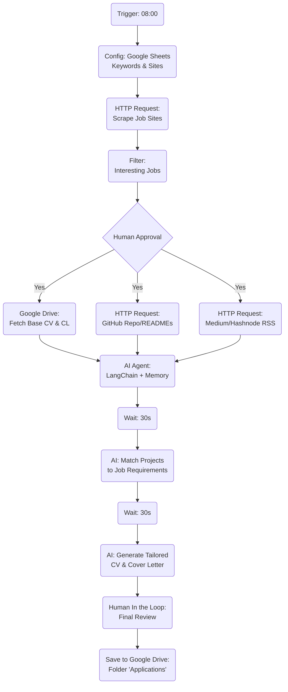

```mermaid
flowchart TD
    %% Start och Discovery
    Start(Trigger: 08:00) --> Config(Config: Google Sheets <br>Keywords & Sites)
    Config --> Scrape(HTTP Request: <br>Scrape Job Sites)
    Scrape --> Filter(Filter: <br>Interesting Jobs)

    %% Human in the Loop (HITL)
    Filter --> HITL{Human Approval}
    
    %% Kontext-insamling (Körs parallellt efter Ja)
    HITL -- Yes --> FetchCV(Google Drive: <br>Fetch Base CV & CL)
    HITL -- Yes --> FetchGitHub(HTTP Request: <br>GitHub Repo/READMEs)
    HITL -- Yes --> FetchBlog(HTTP Request: <br>Medium/Hashnode RSS)

    %% AI Processen med Rate Limit skydd
    FetchCV --> AI_Agent(AI Agent: <br>LangChain + Memory)
    FetchGitHub --> AI_Agent
    FetchBlog --> AI_Agent
    
    AI_Agent --> Wait1(Wait: 30s)
    
    Wait1 --> Logic(AI: Match Projects <br>to Job Requirements)
    Logic --> Wait2(Wait: 30s)
    
    Wait2 --> Generate(AI: Generate Tailored <br>CV & Cover Letter)
    
    Generate --> Review(Human In the Loop: <br>Final Review)
    Review --> Save(Save to Google Drive: <br>Folder 'Applications')

```