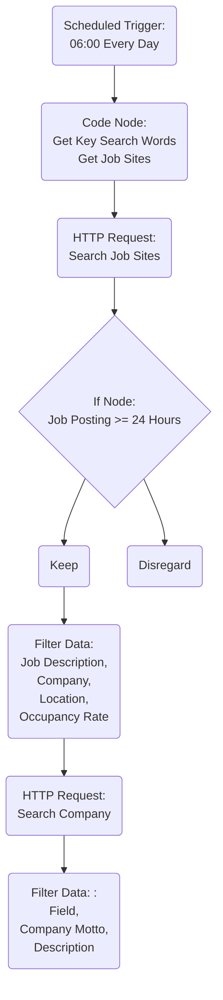

```mermaid
flowchart TD
    %% Start och Datainsamling
    Id1(Scheduled Trigger: <br> 06:00 Every Day) --> Id2(Code Node)

    Id2(Code Node: <br> Get Key Search Words <br> Get Job Sites) --> Id3(HTTP Request) 

    Id3(HTTP Request: <br> Search Job Sites) --> Id4{If Node: <br> Job Posting >= 24 Hours}

    Id4{If Node: <br> Job Posting >= 24 Hours} --> Id5(Keep)

    Id4{If Node: <br> Job Posting >= 24 Hours} --> Id6(Disregard)

    Id5(Keep) --> Id7(Filter Data)

    Id7(Filter Data: <br> Job Description, <br> Company, <br> Location, <br> Occupancy Rate) 
    --> Id8(HTTP Request: <br> Search Company)

    Id8(HTTP Request: <br> Search Company) --> Id9(Filter Data: : <br> Field, <br> Company Motto, <br> Description)
    


```