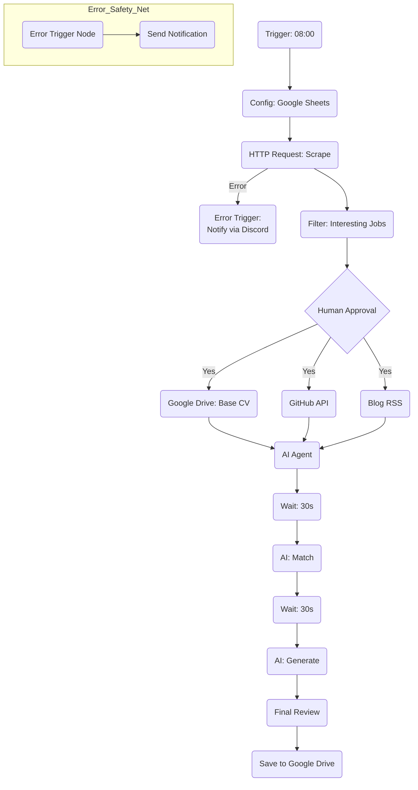

```mermaid
flowchart TD
    %% Start och Discovery
    Start(Trigger: 08:00) --> Config(Config: Google Sheets)
    Config --> Scrape(HTTP Request: Scrape)
    
    %% Felhantering på Scrape
    Scrape -- Error --> ErrorHandler(Error Trigger: <br>Notify via Discord)
    
    Scrape --> Filter(Filter: Interesting Jobs)
    Filter --> HITL{Human Approval}
    
    %% Kontext med 'Continue on Fail'
    HITL -- Yes --> FetchCV(Google Drive: Base CV)
    HITL -- Yes --> FetchGitHub(GitHub API)
    HITL -- Yes --> FetchBlog(Blog RSS)
    
    %% AI Processen
    FetchCV & FetchGitHub & FetchBlog --> AI_Agent(AI Agent)
    
    AI_Agent --> Wait1(Wait: 30s) --> Logic(AI: Match)
    Logic --> Wait2(Wait: 30s) --> Generate(AI: Generate)
    
    %% Slutförande
    Generate --> Review(Final Review)
    Review --> Save(Save to Google Drive)
    
    %% Global felhanterare (n8n feature)
    subgraph Error_Safety_Net
    ErrorNode(Error Trigger Node) --> NotifyUser(Send Notification)
    end

```