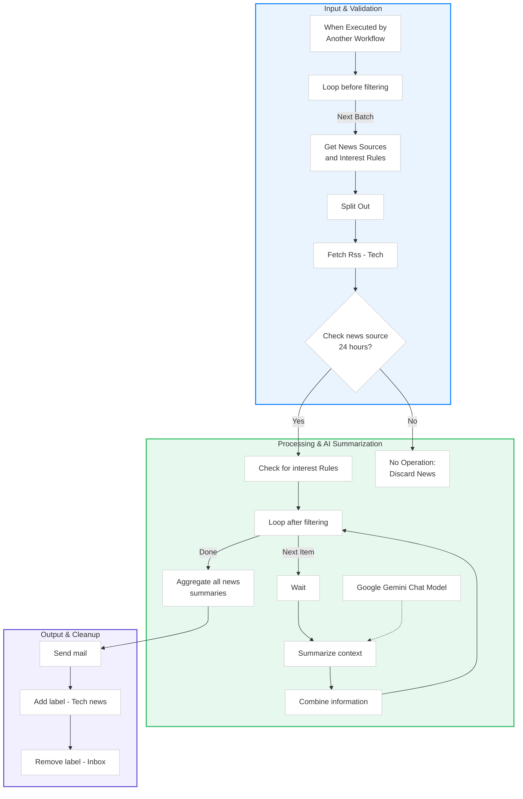

```mermaid
graph TD
    %% SUBGRAPH: INPUT (n8n Blue)
    subgraph Input [Input & Validation]
        A[When Executed by <br> Another Workflow] --> B[Loop before filtering]
        B -- Next Batch --> C[Get News Sources <br> and Interest Rules]
        C --> D[Split Out]
        D --> E[Fetch Rss - Tech]
        E --> F{Check news source <br> 24 hours?}
    end

    %% SUBGRAPH: PROCESSING (n8n Green)
    subgraph Processing [Processing & AI Summarization]
        F -- Yes --> G[Check for interest Rules]
        F -- No --> H[No Operation: <br> Discard News]
        
        G --> I[Loop after filtering]
        
        I -- Next Item --> J[Wait]
        J --> K[Summarize context]
        L[Google Gemini Chat Model] -.-> K
        K --> M[Combine information]
        M --> I
        
        I -- Done --> N[Aggregate all news <br> summaries]
    end

    %% SUBGRAPH: OUTPUT (n8n Purple)
    subgraph Output [Output & Cleanup]
        N --> O[Send mail]
        O --> P[Add label - Tech news]
        P --> Q[Remove label - Inbox]
    end

    %% STYLE DEFINITIONS
    classDef whiteNode fill:#fff,stroke:#ccc,stroke-width:1px,color:#333;
    
    %% n8n Theme Colors
    classDef n8nInput fill:#eaf4ff,stroke:#007bff,stroke-width:2px;
    classDef n8nProcess fill:#e7f9ef,stroke:#1db855,stroke-width:2px;
    classDef n8nOutput fill:#f2f0ff,stroke:#6346d1,stroke-width:2px;

    %% APPLY STYLES
    class A,B,C,D,E,F,G,H,I,J,K,L,M,N,O,P,Q whiteNode;
    class Input n8nInput;
    class Processing n8nProcess;
    class Output n8nOutput;
```