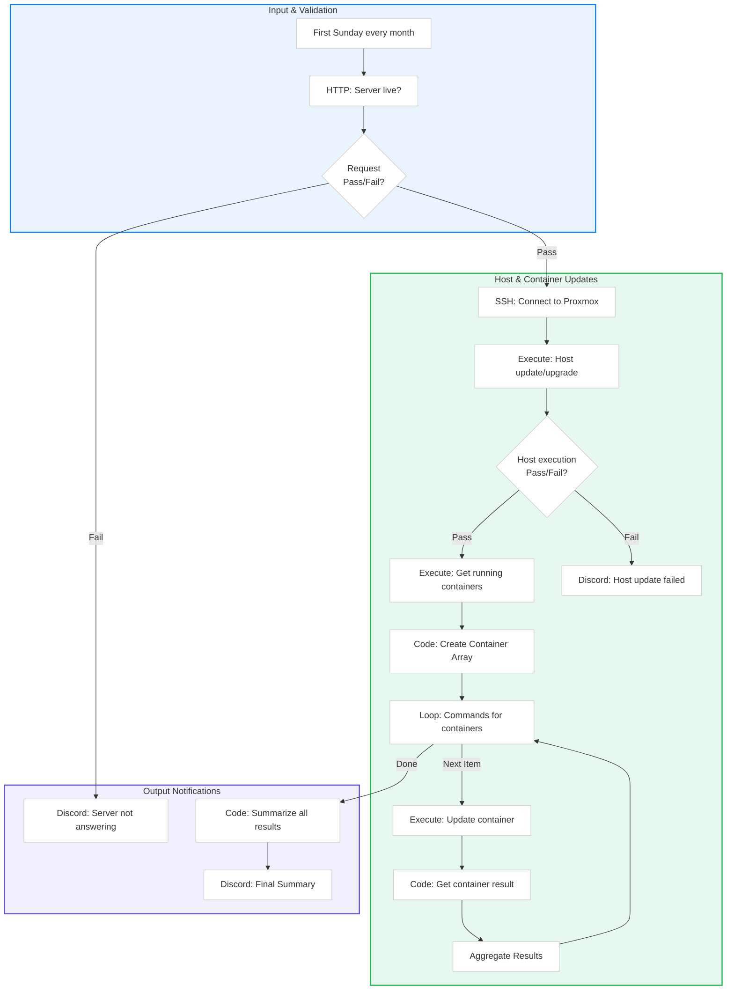

```mermaid
graph TD
    %% SUBGRAPH: INPUT & VALIDATION (n8n Blue)
    subgraph Input [Input & Validation]
        A[First Sunday every month] --> B[HTTP: Server live?]
        B --> C{Request <br> Pass/Fail?}
    end

    C -- Pass --> D[SSH: Connect to Proxmox]
    C -- Fail --> E1[Discord: Server not answering]

    %% SUBGRAPH: PROCESSING (n8n Green)
    subgraph Processing [Host & Container Updates]
        D --> F[Execute: Host update/upgrade]
        F --> G{Host execution <br> Pass/Fail?}
        
        G -- Pass --> H[Execute: Get running containers]
        G -- Fail --> E2[Discord: Host update failed]
        
        H --> I[Code: Create Container Array]
        I --> J[Loop: Commands for containers]
        
        J -- Next Item --> K[Execute: Update container]
        K --> L[Code: Get container result]
        L --> M[Aggregate Results]
        M --> J
    end

    J -- Done --> N[Code: Summarize all results]

    %% SUBGRAPH: OUTPUT (n8n Purple)
    subgraph Output [Output Notifications]
        N --> E3[Discord: Final Summary]
        E1
        E2
    end

    %% STYLE DEFINITIONS
    classDef whiteNode fill:#fff,stroke:#ccc,stroke-width:1px,color:#333;
    
    %% n8n Theme Colors
    classDef n8nInput fill:#eaf4ff,stroke:#007bff,stroke-width:2px;
    classDef n8nProcess fill:#e7f9ef,stroke:#1db855,stroke-width:2px;
    classDef n8nOutput fill:#f2f0ff,stroke:#6346d1,stroke-width:2px;

    %% APPLY STYLES
    class A,B,C,D,F,G,H,I,J,K,L,M,N,E1,E2,E3 whiteNode;
    class Input n8nInput;
    class Processing n8nProcess;
    class Output n8nOutput;
```