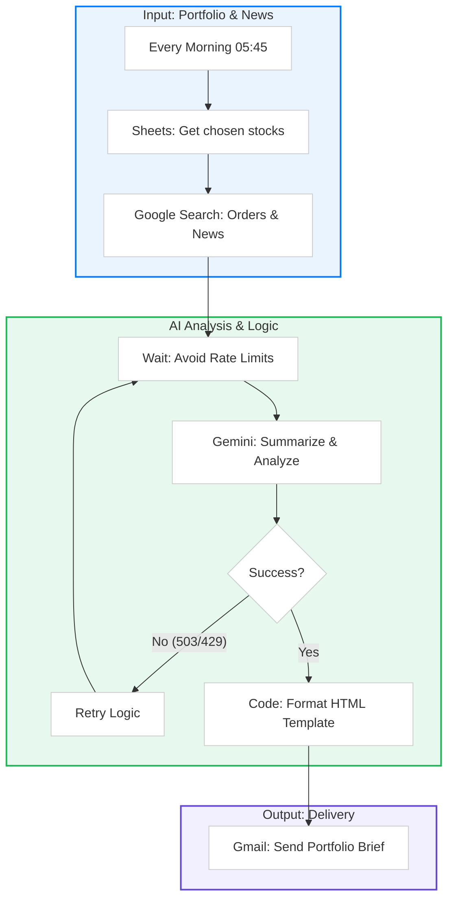

```mermaid
graph TD
    %% SUBGRAPH: INPUT (n8n Blue)
    subgraph Input [Input: Portfolio & News]
        A[Every Morning 05:45] --> B[Sheets: Get chosen stocks]
        B --> C[Google Search: Orders & News]
    end

    %% SUBGRAPH: PROCESSING (n8n Green)
    subgraph Processing [AI Analysis & Logic]
        C --> D[Wait: Avoid Rate Limits]
        D --> E[Gemini: Summarize & Analyze]
        
        E --> F{Success?}
        F -- No (503/429) --> G[Retry Logic]
        G --> D
        
        F -- Yes --> H[Code: Format HTML Template]
    end

    %% SUBGRAPH: OUTPUT (n8n Purple)
    subgraph Output [Output: Delivery]
        H --> I[Gmail: Send Portfolio Brief]
    end

    %% STYLE DEFINITIONS
    classDef whiteNode fill:#fff,stroke:#ccc,stroke-width:1px,color:#333;
    
    %% n8n Theme Colors
    classDef n8nInput fill:#eaf4ff,stroke:#007bff,stroke-width:2px;
    classDef n8nProcess fill:#e7f9ef,stroke:#1db855,stroke-width:2px;
    classDef n8nOutput fill:#f2f0ff,stroke:#6346d1,stroke-width:2px;

    %% APPLY STYLES
    class A,B,C,D,E,F,G,H,I whiteNode;
    class Input n8nInput;
    class Processing n8nProcess;
    class Output n8nOutput;
```